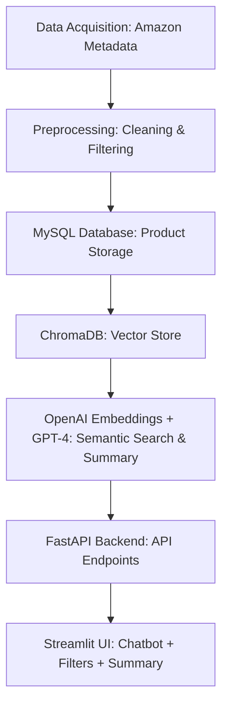

# amazon-product-recommender
## Overview
Online shopping has become a core part of our lives, but it comes with one major drawback, information overload. When a customer searches for something like “good headphones for Zoom calls under $150”, they are bombarded with hundreds of options, most of which are irrelevant. Standard keyword search engines fail to understand intent, leaving the user to manually filter and compare.

This project aims to solve that by building a Smart Retail Assistant: a system that combines semantic AI search with structured filters and natural language explanations. It’s designed to feel like having a smart shopping assistant who understands what you mean, finds the best products, and explains why they are worth considering.

## Dataset
I used the Amazon Product Metadata dataset (via Hugging Face), focusing only on the Electronics category, specifically Laptops and Headphones from 2023.
- **Source:** [Amazon Electronics Metadata (Hugging Face, 2023)](https://huggingface.co/datasets/McAuley-Lab/Amazon-Reviews-2023)
- **Filtered Categories:**
  - 🎧 Headphones
  - 💻 Laptops
- **Final size:** ~30,238 products (after cleaning)
- **Fields kept (including derived):** `asin`, `title`, `brand`, `category_path`, `filtered_category`, `price`, `average_rating`, `rating_number`, `description`, `image_url`, `price_bucket`, `search_text`

## Technology Stack
- **Database:**   
- **Vector Database:** 
- **Embeddings Model:** 
- **LLM for summaries:** 
- **Backend API:** 
- **Frontend:** 
- **ETL:** 

## Project Architecture
### Data Preprocessing and Storage
Once the relevant subset of data was selected, it underwent preprocessing to improve quality and usability. This included:
 - Removing entries with missing or invalid price and rating data.
 - Normalizing inconsistent fields.
 - Creating additional labels, such as price tiers (e.g., budget, midrange, premium).
The cleaned and structured data was then stored in a MySQL relational database, chosen for its robustness in handling structured product catalogs and its ability to support precise filtering.

### Semantic Search with Embeddings
To enable intelligent search functionality, each product description was transformed into a numerical embedding using the OpenAI Embeddings API(`text-embedding-3-small`). These embeddings capture the semantic meaning of product descriptions, for example, "wireless headphones with noise cancellation" and "Bluetooth ANC headset" are mapped close together in the embedding space.
These embeddings were stored in ChromaDB, a vector database optimized for efficient storage and retrieval of high-dimensional embeddings.

### Query Processing and Filtering
When a user enters a search query like, "lightweight gaming laptop under $900 with good battery life" the system performs the following steps:
  - **Semantic Matching:** The query is embedded using the same OpenAI model and compared against the 30,238 product embeddings stored in ChromaDB. This returns a list of semantically similar products, even when the query and descriptions use different wording.
  - **Precision Filtering:** The initial semantic results are further filtered in MySQL to enforce exact constraints, such as price limits, category type, and minimum rating thresholds. This ensures the results meet both the intent and the criteria of the user.
In short, ChromaDB provides intelligent matching, while MySQL ensures accuracy and rule based filtering.

### Natural Language Summarization
To enhance user experience, the top results are passed to a `GPT-4o-mini` language model, which generates a concise natural language summary. This summary:
  - Highlights trade-offs between products
  - Suggests a “Value Pick,” “Best Overall,” and “Premium Choice”
  - Provides plain English guidance to help users make informed decisions

### User Interface
The entire system is wrapped in an interactive front end built with Streamlit. Key features of the interface include:
  - Product cards displaying images, titles, prices, ratings, and direct Amazon links.
  - A persistent AI summary panel offering natural language insights into the search results.

This combination of structured data, semantic understanding, and natural language generation delivers a smart, approachable shopping assistant that feels intuitive and insightful to use.

## Work Flow

## Future Improvements
While I focused on laptops and headphones to keep things manageable, there’s definitely room to improve and expand this project further. 
  - **Expanding Product Categories:** Including additional product types would make the assistant more comprehensive and applicable to a wider audience.
  - **Cloud Deployment:** Hosting the system online would enable public access and improve scalability.
  - **Personalization:** Adding the ability to remember user preferences and tailor recommendations could greatly enhance the user experience.
    
## Conclusion
The Smart Retail Assistant isn’t just a demo, it’s a complete example of how modern AI can transform the way we shop online. By bringing together semantic embeddings, language models, and traditional databases, this project shows how these technologies can work hand-in-hand to create a smart, intuitive shopping assistant.

For me personally, building this was as much about understanding how all the pieces fit together as it was about solving the problem. I hope it gives you a clear look at what’s possible when AI meets real world applications.
